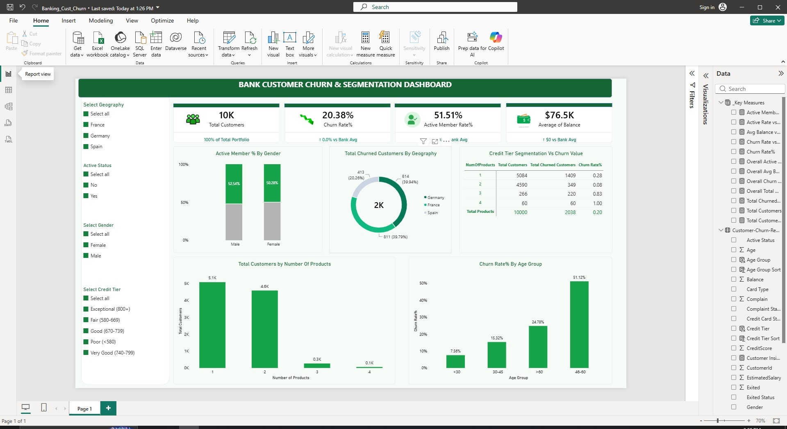

# Bank Customer Churn & Segmentation Analytics Dashboard

An executive-level, interactive Power BI analytics dashboard designed to analyze customer churn patterns, evaluate portfolio risk, and uncover actionable retention insights for retail banking leaders.



---

## Executive Summary & Business Context

Customer churn is one of the most critical metrics for retail banking institutions. Acquiring new banking clients costs significantly more than retaining existing account holders. This project delivers an end-to-end Business Intelligence solution that converts raw customer account records into a structured analytical environment.

The dashboard integrates an executive top-row KPI panel featuring dynamic baseline comparison logic (**Reference Labels** in Power BI's New Card Visual), demographic segmentation, product engagement analysis, and regional risk profiling.

---

## Key Business Insights

1. **High Churn in Key Regions:** Customers located in **Germany** exhibit a significantly higher churn rate (~39.9%) compared to France and Spain (~16.1% and ~16.6%), despite having similar balance profiles.
2. **Product Engagement Anomaly:** Customers holding **3 or 4 bank products** show an alarming churn rate approaching 85%–100%, signaling potential cross-selling friction or product dissatisfaction.
3. **Age & Risk Correlation:** The **45–60 age bracket** experiences the highest percentage of churn (~43.99%), making them the primary demographic target for high-value retention campaigns.
4. **Active Status Sensitivity:** Non-active bank members churn at nearly twice the rate of active members, underscoring the importance of early re-engagement initiatives.

---

## Data Pipeline & Data Cleaning Process

The dataset consists of **10,000 bank customer records** with demographic, credit, balance, and account activity attributes. The following ETL and data transformation steps were executed in **Power Query / Data Model**:

1. **Schema Standardization & Column Cleanup:**
   * Removed unnecessary primary surrogate keys (`RowNumber`, `CustomerId`, `Surname`) from reporting view to optimize model size and memory.
   * Standardized column header naming conventions (`Geography`, `Gender`, `Age`, `Tenure`, `Balance`, `NumOfProducts`, `HasCrCard`, `IsActiveMember`, `EstimatedSalary`, `Exited`).

2. **Calculated Categorical Groupings:**
   * **Age Groups:** Binned continuous `Age` values into strategic demographic brackets (`<30`, `30-45`, `45-60`, `>60`) for cohort analysis.
   * **Credit Score Tiers:** Segmented raw `CreditScore` into risk tiers (`Poor (<580)`, `Fair (580-669)`, `Good (670-739)`, `Very Good (740-799)`, `Exceptional (800+)`).

3. **Data Type & Quality Validation:**
   * Enforced explicit data types (Fixed Decimal for `Balance` and `EstimatedSalary`, Whole Number for `Tenure` and `NumOfProducts`, Boolean/Binary for status indicators).
   * Verified zero null or missing values across critical key dimensions.

---

## DAX Measures & Analytical Logic

All calculations are centralized in a dedicated `_Key Measures` table for optimal performance and maintainability.

### 1. Primary Core Metrics

```dax
// Total Customer Base Count
Total Customers = COUNTROWS('Customer-Churn-Records')

// Total Number of Churned Customers
Total Churned Customers = CALCULATE([Total Customers], 'Customer-Churn-Records'[Exited] = 1)

// Overall Churn Percentage
Churn Rate% = DIVIDE([Total Churned Customers], [Total Customers], 0)

// Active Member Percentage
Active Member Rate% = 
VAR ActiveCount = CALCULATE([Total Customers], 'Customer-Churn-Records'[IsActiveMember] = 1)
RETURN DIVIDE(ActiveCount, [Total Customers], 0)

// Portfolio Average Balance
Average of Balance = AVERAGE('Customer-Churn-Records'[Balance])
```

---

### 2. Portfolio Baselines (Slicer-Neutral References)

```dax
// Bank-Wide Churn Baseline
Overall Churn Rate = 
CALCULATE(
    [Churn Rate%], 
    ALL('Customer-Churn-Records')
)

// Bank-Wide Active Member Baseline
Overall Active Rate = 
CALCULATE(
    [Active Member Rate%], 
    ALL('Customer-Churn-Records')
)

// Bank-Wide Total Customer Count
Overall Total Customers = 
CALCULATE(
    [Total Customers], 
    ALL('Customer-Churn-Records')
)

// Bank-Wide Average Balance Baseline
Overall Avg Balance = 
CALCULATE(
    AVERAGE('Customer-Churn-Records'[Balance]), 
    ALL('Customer-Churn-Records')
)
```

---

### 3. Dynamic Executive Reference Labels

These DAX measures feed directly into the **Card (new)** visual reference label property to provide real-time benchmarking against bank averages when filters are applied:

```dax
// Total Customers Portfolio Share Label
Total Customers vs Avg Label = 
VAR OverallTotal = [Overall Total Customers]
VAR CurrentTotal = [Total Customers]
VAR PctShare = DIVIDE(CurrentTotal, OverallTotal, 0)
RETURN
IF(
    PctShare = 1,
    "100% of Total Portfolio",
    FORMAT(PctShare, "0.0%") & " of Total Base"
)

// Churn Rate Variance Label vs Bank Average
Churn Rate vs Avg Label = 
VAR OverallAvg = [Overall Churn Rate]
VAR SegmentRate = [Churn Rate%]
VAR Diff = SegmentRate - OverallAvg
RETURN
IF(
    Diff <= 0,
    "↑ " & FORMAT(ABS(Diff), "0.0%") & " vs Bank Avg",
    "↓ " & FORMAT(Diff, "0.0%") & " vs Bank Avg"
)

// Active Member Rate Variance Label vs Bank Average
Active Rate vs Avg Label = 
VAR OverallRate = [Overall Active Rate]
VAR SegmentRate = [Active Member Rate%]
VAR Diff = SegmentRate - OverallRate
RETURN
IF(
    Diff >= 0,
    "↑ " & FORMAT(ABS(Diff), "0.0%") & " vs Bank Avg",
    "↓ " & FORMAT(ABS(Diff), "0.0%") & " vs Bank Avg"
)

// Average Balance Variance Label vs Bank Average
Avg Balance vs Overall Label = 
VAR OverallBal = [Overall Avg Balance]
VAR SegmentBal = AVERAGE('Customer-Churn-Records'[Balance])
VAR Diff = SegmentBal - OverallBal
RETURN
IF(
    Diff >= 0,
    "↑ " & FORMAT(ABS(Diff), "$#,##0") & " vs Bank Avg",
    "↓ " & FORMAT(ABS(Diff), "$#,##0") & " vs Bank Avg"
)
```

---

## Dashboard Design & Visual Architecture

* **Grid System:** Structured dark-sidebar / light-canvas grid optimized for executive readability.
* **Color Palette:**
  * **Primary Accent:** Emerald Green (`#10B981`) & Deep Forest Green (`#047857`) for positive indicators and callouts.
  * **Secondary Tones:** Slate Gray (`#4B5563`) and Light Slate (`#E2E8F0`) for borders and dividers.
* **Core Visual Elements:**
  1. **New Card Visuals (KPI Row):** Embedded dynamic reference labels, vertical dividers, and icon placement.
  2. **Active Member % By Gender:** Stacked column chart analyzing engagement by gender.
  3. **Total Churned Customers By Geography:** Donut chart highlighting regional distribution.
  4. **Credit Tier & Product Matrix:** Cross-tabular breakdown of customer volume, churn counts, and rates.
  5. **Total Customers by NumOfProducts:** Column chart detailing cross-sell depth.
  6. **Churn Rate% By Age Group:** Column chart pinpointing high-risk demographic brackets.

---

## Tech Stack & Tools

* **Business Intelligence:** Microsoft Power BI Desktop
* **Data Transformation:** Power Query / M
* **Data Modeling & Analytics:** DAX (Data Analysis Expressions)
* **Version Control & Portfolio:** GitHub

---

## How to Use / Reproduce

1. Clone or download this repository:
   ```bash
   git clone https://github.com/zaib-analyst/Banking-Customer-Churn-Analysis.git
   ```
2. Open `Banking_Customer_Churn.pbix` in **Microsoft Power BI Desktop**.
3. Ensure `Banking_Customer_Churn_Screenshot.jpg` is in the same directory if reviewing markdown documentation offline.
4. Interact with the left sidebar slicers (**Geography**, **Gender**, **Age Group**, **Tenure**, **Credit Tier**) to explore dynamic risk profiling across customer segments.

---

Developed by **Muhammad Ali Zaib** | Data Analyst & BI Specialist
